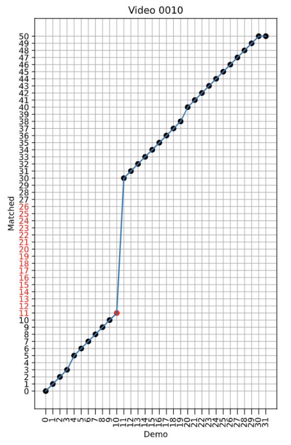

# Extraneousness-Aware Imitation Learning (EIL)

[Ray Chen Zheng](https://zhengrc19.github.io), [Kaizhe Hu](https://scholar.google.com/citations?user=mPpYLhcAAAAJ), Zhecheng Yuan, [Boyuan Chen](https://people.csail.mit.edu/boyuanc/), [Huazhe Xu](http://hxu.rocks).

[[arxiv]](https://arxiv.org/abs/2210.01379) [ICRA '23] [[video]](https://sites.google.com/view/eil-website/)


We propose **Extraneousness-Aware Imitation Learning (EIL)** to solve *locally consistent yet task irrelevant* subsequences in demonstrations.

EIL selects the correct behavior to imitate by learning **action-conditioned frame representations** to filter out task-irrelevant parts of demonstrations. 

# Setup
To setup, it is recommended that you first create a conda environment and switch to it. Then run:
```bash
bash setup.sh
```
If errors occur, you may need to install some packages using `apt-get` or `yum` and retry.

# Dataset Generation
To generate demonstrations with extraneousness, just run
```bash
python -m demo_generation.DemoGeneration
```
and a new dataset will be generated. You can change the name of the dataset or the task performed in `demo_generation/DemoGeneration.py`'s `if __name__ == '__main__'` section.

# Training
Suppose it is May 29, and we want to train an EIL on the extraneousness-rich *reach* dataset we just generated. We would like to name this train session `0529_01`, and we already have with us the config file named `0529_01_eil_config.yml`.
## 1. Action Conditioned TCC Representation Learning
```bash
python eil_train.py --algo eil --train_id 0529_01 --dataset reach_0529
```
## 2. UVA and Dataset Filtering
## 3. Imitation Learning
For these two steps, simply running
```bash
python after_pretrain.py 0529_01 -1 reach_0529 0
```
would give you everything.
The four arguments stand for the train ID (session name), the checkpoint index to use (-1 means last checkpoint), the name of the dataset, and the number of the GPUs allowed.

# Evaluation
## UVA Results
A PDF is automatically generated for all the checkpoints during the TCC training. The figure is basically the same as Figure 4 of our paper:




## IL Results
The `after_pretrain.py` script contains an evaluation phase as well, which uses code in `eval_in_env.py`. Results are automatically added to `eval_results.xlsx` for later analyses.


# Acknowledgement
EIL's codebase is based on [XIRL](https://github.com/google-research/google-research/tree/master/xirl)'s code. We'd like to thank the authors for providing a codebase easy to debug and build upon.

# To cite EIL
The `bibtex` for our published version in ICRA is coming soon. For the arXiv preprint, you can cite us through `bibtex`:
```
@misc{zheng2023extraneousnessaware,
      title={Extraneousness-Aware Imitation Learning}, 
      author={Ray Chen Zheng and Kaizhe Hu and Zhecheng Yuan and Boyuan Chen and Huazhe Xu},
      year={2023},
      eprint={2210.01379},
      archivePrefix={arXiv},
      primaryClass={cs.RO}
}
```